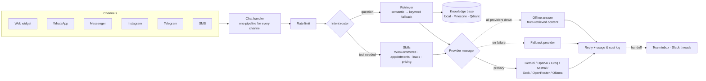
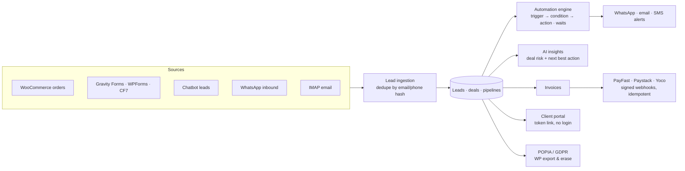

# Outview AI Products: Architecture & Engineering Showcase

Two commercial WordPress products I designed, built and sell through [Outview](https://outview.co.za), my Cape Town-based AI business solutions company:

| Product | What it is | Size |
|---|---|---|
| **[AI Support Agent](docs/ai-support-agent.md)** (sold as *Outview AI Chatbot*) | Self-hosted RAG support chatbot with 7-provider LLM fallback, tool-calling skills, a flow builder, a team inbox and multi-channel messaging | ~23,000 lines of PHP across 158 files · 26 database tables · 29 REST routes |
| **[SA SME CRM](docs/sa-sme-crm.md)** | B2B CRM for South African SMEs: pipelines, automations, AI deal insights, WhatsApp, local payment gateways, POPIA tooling | ~13,500 lines of PHP + a React 19 / TypeScript admin UI (~5,000 lines, 37 Vitest test files) · 13 tables · 25 REST routes |

> **About this repo.** Both are paid products, so the full source isn't published. This repo documents what they do, how they're architected and the engineering decisions behind them..

**See it live:** the chat widget on [outview.co.za](https://outview.co.za) runs AI Support Agent.

---

## AI Support Agent at a glance

- **One pipeline, many channels:** the web widget and every messaging adapter call the same chat handler, so retrieval, skills, forms and business-hours rules behave the same everywhere, with no per-channel branching.
- **Never a dead end:** primary provider → fallback provider → an answer built straight from the retrieved site content if every provider is unreachable.
- **RAG that works on a free tier:** keyword retrieval with stop-word filtering always works; embedding-based semantic search (local, Pinecone or Qdrant) is used when enabled, falling back to keyword search if it returns nothing.
- **Licence tiers in one place:** a single capability map decides which of 37 gated features each tier unlocks (including site limits of 1, 3 and 50); the rest of the code just asks `can('feature.key')`.

[Full write-up →](docs/ai-support-agent.md)

## SA SME CRM at a glance

- **Built for cheap SA shared hosting:** custom `wpdb` tables for query speed, IMAP email sync (works with cPanel/Afrihost/Xneelo mailboxes, not just Gmail), and graceful degradation when PHP extensions like `imap` or `openssl` are missing.
- **Local payments, done safely:** PayFast, Paystack and Yoco webhooks are signature-verified, and the "mark invoice paid" step is idempotent, so gateway retries are harmless.
- **AI where it's cheap and useful:** deal-risk and next-best-action insights are generated only when a rep clicks, across 5 LLM providers plus Outview's own hosted option, with fallback.

[Full write-up →](docs/sa-sme-crm.md)

## Engineering approach

Patterns that run through both codebases ([notes](docs/engineering-notes.md)):

1. **Graceful degradation everywhere:** LLM outages, missing PHP extensions, lapsed licences and unreachable licence servers all degrade to a working state, never a fatal error
2. **Single source of truth:** one capability map, one segment-to-SQL builder, one chat pipeline, one place where invoices get marked paid
3. **Pure, testable core logic:** decision logic (flow state machine, offline answers, Slack signature checks, automation waits) is kept free of WordPress calls so it can be unit-tested without a live site
4. **Security at the boundaries:** HMAC/signature checks on every inbound webhook (Slack, Meta, Telegram, SMS, payment gateways), nonce-guarded public REST routes, chat rate limiting, and (in the CRM) API keys encrypted at rest
5. **Loose coupling between products:** the CRM reads chatbot leads through the chatbot's own public API instead of patching it, so either plugin can be updated or removed independently

## Tech

**Backend:** PHP 7.4–8.x · WordPress plugin APIs (REST, WP-Cron, privacy exporters/erasers, transients) · WooCommerce · MySQL via `wpdb`
**AI:** Gemini · OpenAI (incl. Assistants API and fine-tuning) · Groq · Mistral · Grok · OpenRouter · Ollama · Anthropic Claude · embeddings · Pinecone · Qdrant · Whisper & ElevenLabs voice
**Frontend:** React 19 · TypeScript · Vite · TanStack Query/Table · Zustand · Radix UI · Vitest
**Integrations:** Meta WhatsApp Cloud API · Messenger · Instagram · Telegram · Slack Events API · Google Calendar OAuth · HubSpot · FluentCRM · Mailchimp · Pipedrive · ActiveCampaign · PayFast · Paystack · Yoco · BulkSMS

## Related

- [policy-assistant](https://github.com/henfredpietersen/policy-assistant): the core RAG ideas rebuilt in Python with scikit-learn, retrieval evaluation (Hit@k, MRR), FastAPI, Docker and GitHub Actions CI.

---

**Henfred Pietersen** · Cape Town · [LinkedIn](https://linkedin.com/in/henfredpietersen) · henfredpietersen@gmail.com
