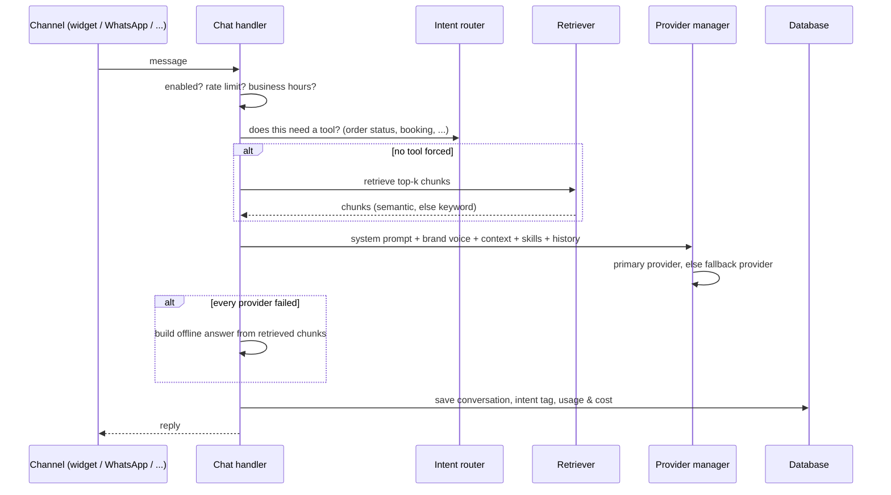

# AI Support Agent (sold as Outview AI Chatbot)

A self-hosted AI support chatbot for WordPress, sold as a one-time licence (Starter / Professional / Agency) through outview.co.za and CodeCanyon. The pitch to buyers: a SaaS-grade support bot with no monthly fee, where conversations, leads and the knowledge base never leave their own WordPress database.

**Scale:** ~23,000 lines of PHP across 158 files, 26 custom database tables, 29 REST routes, plus the JavaScript chat widget.

## Request pipeline

Every message, from the web widget or any messaging channel, goes through one orchestrator:

## Retrieval (RAG)

| Piece | How it works |
|---|---|
| **Sources** | Posts, pages, menus and WooCommerce products by default; custom post types, PDF, CSV, XML and sitemap ingestors on Professional+ |
| **Chunking & indexing** | Content crawler → chunker → knowledge repository, with a source-health report showing what failed to index and why |
| **Keyword search** | Always available, needs no embedding API: term scoring with a stop-word list, added after common question words ("what", "have", "you") were found to outrank genuinely relevant pages |
| **Semantic search** | Embedding cosine similarity, stored locally or in **Pinecone** or **Qdrant**; falls back to keyword search if it returns nothing |
| **Offline answer** | If no provider can answer, the best retrieved chunk is returned as a cleanly trimmed excerpt (cut at a sentence boundary) instead of "sorry, try again" |

## LLM providers

Seven chat providers behind one interface: **Gemini, Groq, OpenAI, Mistral, Grok, OpenRouter, Ollama** (local, for buyers who want no external API at all). The site owner sets a primary and a fallback provider. OpenAI also supports **Assistants API mode** and **fine-tuned models**. Every call logs tokens in/out and an estimated cost per provider, which feeds the analytics and an ROI calculation (lead value × conversions vs AI spend).

## Skills (tool calling)

The model can call skills, and an intent router can force a skill when a message clearly needs one:

- **WooCommerce:** product search, order status, coupon check, shipping estimate, add to cart, upsell recommendations
- **Appointments:** list services, check availability, book, reschedule, cancel, with **Google Calendar** sync (OAuth) and reminder notifications
- **Leads and pricing:** capture a lead, answer pricing questions

If a booking request hits a provider failure, the details are captured as a lead instead of being lost.

## Engagement

- **Flow builder:** scripted conversations with 7 node types (message, question, condition, handoff, end, date picker, calculator), a visual diagram preview, and a state machine that's unit-testable without WordPress
- **Proactive campaigns:** 6 triggers (exit intent, scroll depth, time on page, URL, cart abandonment, returning visitor) with A/B variants
- **Abandoned-cart recovery:** cart snapshots plus recovery emails
- **Conversational forms**, **brand-voice controls** (with a suggestion generated from the site's own content), **CSAT ratings**, and multi-language support including all 11 South African official languages

## Team & channels (Agency tier)

- **Team inbox** with human handoff, internal notes, agent roles, live presence and typing indicators
- **Slack:** notifications, plus replying to a visitor straight from a Slack thread via the Events API, with request signatures verified (Slack v0 HMAC scheme)
- **Channels:** WhatsApp, Messenger, Instagram (shared Meta webhook verification), Telegram and SMS adapters, all feeding the same chat pipeline
- **Voice:** speech-to-text and text-to-speech via OpenAI and ElevenLabs
- **Agency tools:** multi-client dashboard, client access, reusable settings templates, white-label branding

## CRM sync

FluentCRM, HubSpot, Mailchimp, Pipedrive and ActiveCampaign, plus outbound webhooks for other systems.

## Licensing

- **One capability map** (`Capabilities::FEATURE_TIER`) assigns each of 37 gated features to the tier where it unlocks; tiers are cumulative and every check in the codebase is `can('feature.key')`
- Licences are verified against the Outview licensing server, which issues keys automatically on purchase and enforces site limits per tier on the server: **1 site** (Starter), **3 sites** (Professional), **50 sites** (Agency)
- **Fail-safe for visitors:** if the licence server is unreachable, a previously valid site gets a **7-day grace period**; even after that, only the admin settings and analytics screens lock. Chat and RAG keep working
