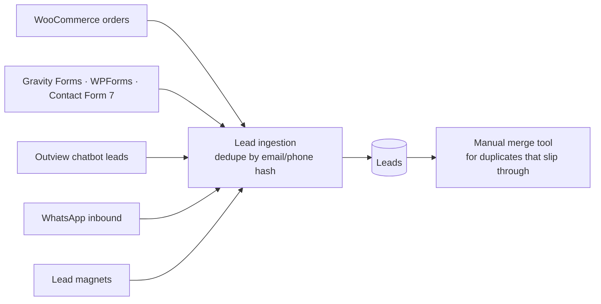

# SA SME CRM

A B2B CRM for South African small businesses, running inside WordPress. Designed around the realities of the local market: cheap shared hosting, WhatsApp as the main business channel, local payment gateways and POPIA compliance.

**Scale:** ~13,500 lines of PHP across 45 files, 13 custom tables, 25 REST routes, plus a React 19 / TypeScript admin UI (~5,000 lines, 37 Vitest test files).

## Data model and performance

Leads, deals, pipelines, activity, messages and invoices live in **custom `wpdb` tables** rather than WordPress posts, for real query performance on shared hosting. Dynamic **saved segments** store their rules as JSON and are turned into SQL by a single class with a field/operator whitelist, so every screen shares one validated query path.

## Lead capture

- **WooCommerce bridge:** each captured order also becomes a deal, and the deal's stage follows the order: completed → Won, cancelled/refunded/failed → Lost
- **Chatbot bridge:** reads the chatbot's lead table and marks leads as synced through the chatbot's own public API, so the two plugins never patch each other and can be installed or removed independently

## Automations

A trigger → condition → action engine. Triggers: lead created, lead status changed, deal moved to stage, lead score crosses threshold, WhatsApp message received, cart abandoned. **Every** matching automation runs (not first-match-wins), and runs can **wait** (minutes, hours, days) and resume from a cron-driven queue.

## Communication

- **WhatsApp** via the Meta Cloud API: outbound messages, an inbound webhook that matches or creates leads, and delivery-status tracking
- **Email sync over IMAP**, chosen over Gmail/Outlook-only OAuth because SA SMEs are as likely to use cPanel, Afrihost or Xneelo mailboxes; de-duplicated by Message-ID across forward sync and backfill
- **BulkSMS alerts** so a rep without email open still hears about a hot lead

## AI insights

On-demand **deal-risk flag and next-best-action** per lead, generated only when a rep clicks, so there's no background cost. Providers: Gemini, Groq, Anthropic Claude, OpenAI, Mistral, or Outview's hosted option, with primary + fallback. Deliberately kept small to avoid the over-reach of enterprise CRM AI for non-technical owners.

## Invoicing and payments

Invoices with payment links through **PayFast, Paystack and Yoco**:

- PayFast ITNs are checked against PayFast's ordered-parameter signature **and** re-validated with PayFast's own server
- Paystack webhooks are verified with HMAC-SHA512 using a constant-time comparison
- One method owns "mark invoice paid", so a webhook delivered twice is a harmless no-op

## Client portal

Clients view their own projects, documents, quotes and invoices through a bookmarkable link with a random per-client token: no account, no password resets.

## Security and compliance

- **Owner-scoped permissions:** reps see their own leads and deals plus the unassigned pool; admins see everything
- **Secrets encrypted at rest** (API keys, passwords) with a key derived from WordPress's per-site salt; degrades gracefully on hosts without OpenSSL
- **POPIA/GDPR:** consent tracking and an erasure workflow on the lead record, plus registration with WordPress's built-in export/erase personal-data tools
- **White-label** branding for agencies reselling it

## Admin UI

Classic PHP screens are being migrated to a **React 19 + TypeScript** app (Vite, TanStack Query and Table, Zustand, Radix UI, React Hook Form + Zod) one screen at a time. Leads, Pipeline and Dashboard are migrated so far, with component and page tests in Vitest.
